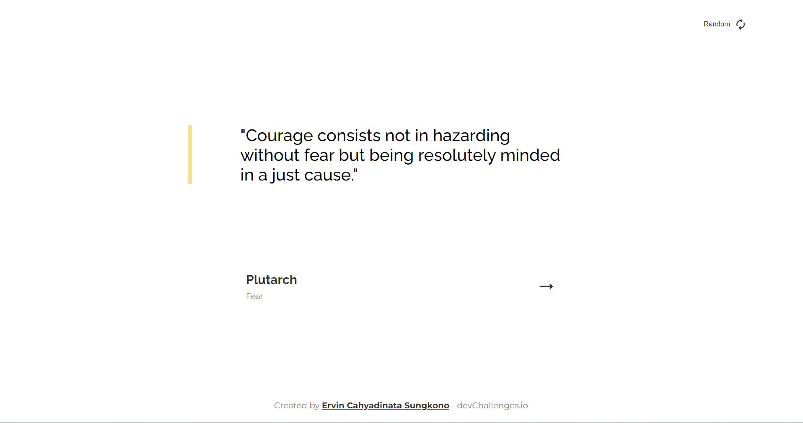

<h1 align="center">Todo App using Vue.js</h1>

<div align="center">
   Solution for a challenge from  <a href="http://devchallenges.io" target="_blank">Devchallenges.io</a>.
</div>

<div align="center">
  <h3>
    <a href="https://{your-demo-link.your-domain}">
      Demo
    </a>
    <span> | </span>
    <a href="https://{your-url-to-the-solution}">
      Solution
    </a>
    <span> | </span>
    <a href="https://devchallenges.io/challenges/hH6PbOHBdPm6otzw2De5">
      Challenge
    </a>
  </h3>
</div>

<!-- TABLE OF CONTENTS -->

## Table of Contents

- [Overview](#overview)
  - [Built With](#built-with)
- [Features](#features)
- [How to use](#how-to-use)
- [Contact](#contact)

<!-- OVERVIEW -->

## Overview



The output of this project is a simple todo app where users can add a todo, see active and completed todos, delete completed todos, and store added todos in a local storage.

### Built With
- [Vue.js](https://vuejs.org/)

## Features
This application/site was created as a submission to a [DevChallenges](https://devchallenges.io/challenges) challenge. The [challenge](https://devchallenges.io/challenges/hH6PbOHBdPm6otzw2De5) was to build an application to complete the given user stories.

## How To Use
To clone and run this application, you'll need [Git](https://git-scm.com) and [Node.js](https://nodejs.org/en/download/) (which comes with [npm](http://npmjs.com)) installed on your computer. From your command line:

```bash
$ git clone https://github.com/ervin-sungkono/DevChallenges.io.git

$ git checkout todo-app

$ npm install

$ npm start
```

## Contact

- [Website](https://ervin-sungkono.vercel.app)
- [Github](https://github.com/ervin-sungkono)
- [LinkedIn](https://www.linkedin.com/in/ervin-cahyadinata-sungkono/)
